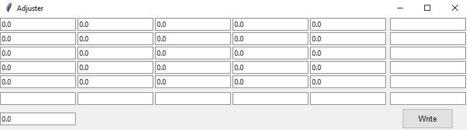
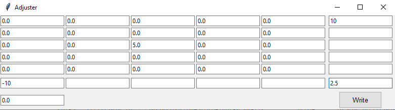
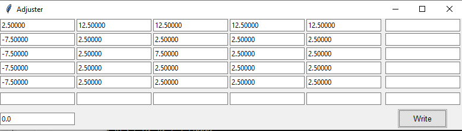

# Bed level adjustment tool! Wooh!

Bed leveling can be tedious. So I wrote a tool to make adjustments easier to perform.

Just run `adjust_bed.py`.

It expects a simple file called `bed.txt` which contains the initial/previous values.

```none
0, 0, 0, 0, 0
0, 0, 0, 0, 0
0, 0, 0, 0, 0
0, 0, 0, 0, 0
0, 0, 0, 0, 0
0.0
```

First are a number of rows with comma-separated values, then on the final line is a Z-offset.

The script reads the file and identifies that it is a 5x5-configuration, then presents this view



The values that are filled in are from the file. As a demonstration, we want
* Increase the distance to the bed for the topmost row by 10mm
* Decrease it by 10mm for the first column
* Increase the distance by 5mm for the centermost point
* Add 2.5mm distance to the whole bed



As we click on the _Write_ button, the values are updated accordingly and a `bed.out` file is generated with the new values. We _do not_ overwrite the `bed.txt` file!



Additionally, G-code is written to a file `adjusted_bed.gco` which you can just send to the printer to load and activate the settings. This file _is_ overwritten when you press _Write_!

```none
; Row 0
G29 S3 I0 J0 Z-7.50000
G29 S3 I1 J0 Z2.50000
G29 S3 I2 J0 Z2.50000
G29 S3 I3 J0 Z2.50000
G29 S3 I4 J0 Z2.50000
; Row 1
G29 S3 I0 J1 Z-7.50000
G29 S3 I1 J1 Z2.50000
G29 S3 I2 J1 Z2.50000
G29 S3 I3 J1 Z2.50000
G29 S3 I4 J1 Z2.50000
; Row 2
G29 S3 I0 J2 Z-7.50000
G29 S3 I1 J2 Z2.50000
G29 S3 I2 J2 Z7.50000
G29 S3 I3 J2 Z2.50000
G29 S3 I4 J2 Z2.50000
; Row 3
G29 S3 I0 J3 Z-7.50000
G29 S3 I1 J3 Z2.50000
G29 S3 I2 J3 Z2.50000
G29 S3 I3 J3 Z2.50000
G29 S3 I4 J3 Z2.50000
; Row 4
G29 S3 I0 J4 Z2.50000
G29 S3 I1 J4 Z12.50000
G29 S3 I2 J4 Z12.50000
G29 S3 I3 J4 Z12.50000
G29 S3 I4 J4 Z12.50000
; Z-offset
G29 S4 Z0.0
M420 S1 ; Bed leveling
M420 V ; Report back the configuration
```

The content of `bed.out` is now

```none
 -7.50000,   2.50000,   2.50000,   2.50000,   2.50000
 -7.50000,   2.50000,   2.50000,   2.50000,   2.50000
 -7.50000,   2.50000,   7.50000,   2.50000,   2.50000
 -7.50000,   2.50000,   2.50000,   2.50000,   2.50000
  2.50000,  12.50000,  12.50000,  12.50000,  12.50000
0.0
```

As you may observe, the rows are inverted here compared to what the UI shows.
The results are read/written to the `bed.*`-files in the same way that the output of the `M420 V`-command prints the values.
For me the "topmost" then corresponds to the levels at the "front" of the printer as I stand before it, which is unintuitive.
Therefore I added axis-inversion when loading/writing files and generating G-code.
Which axis to invert is configurable by changing the `invertX=False, invertY=True`-arguments passed in the `main`-function.


